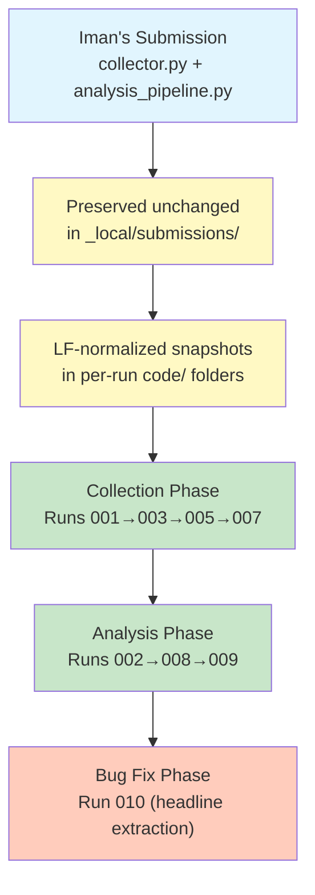
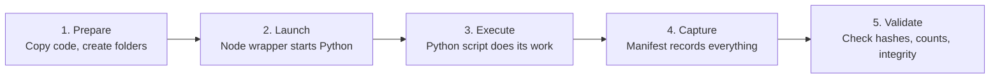
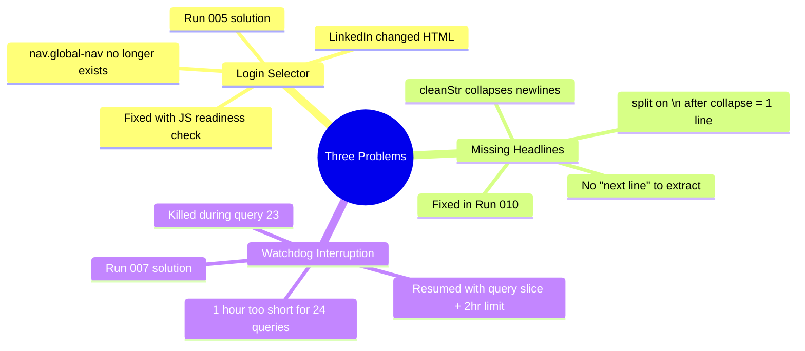
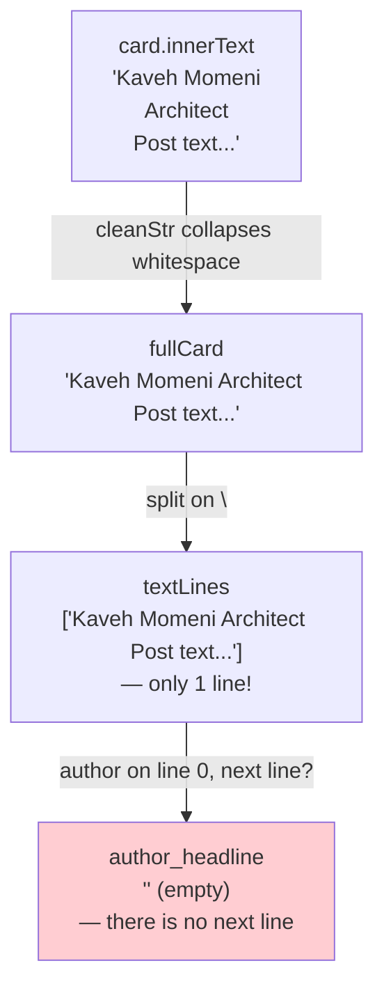
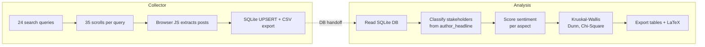
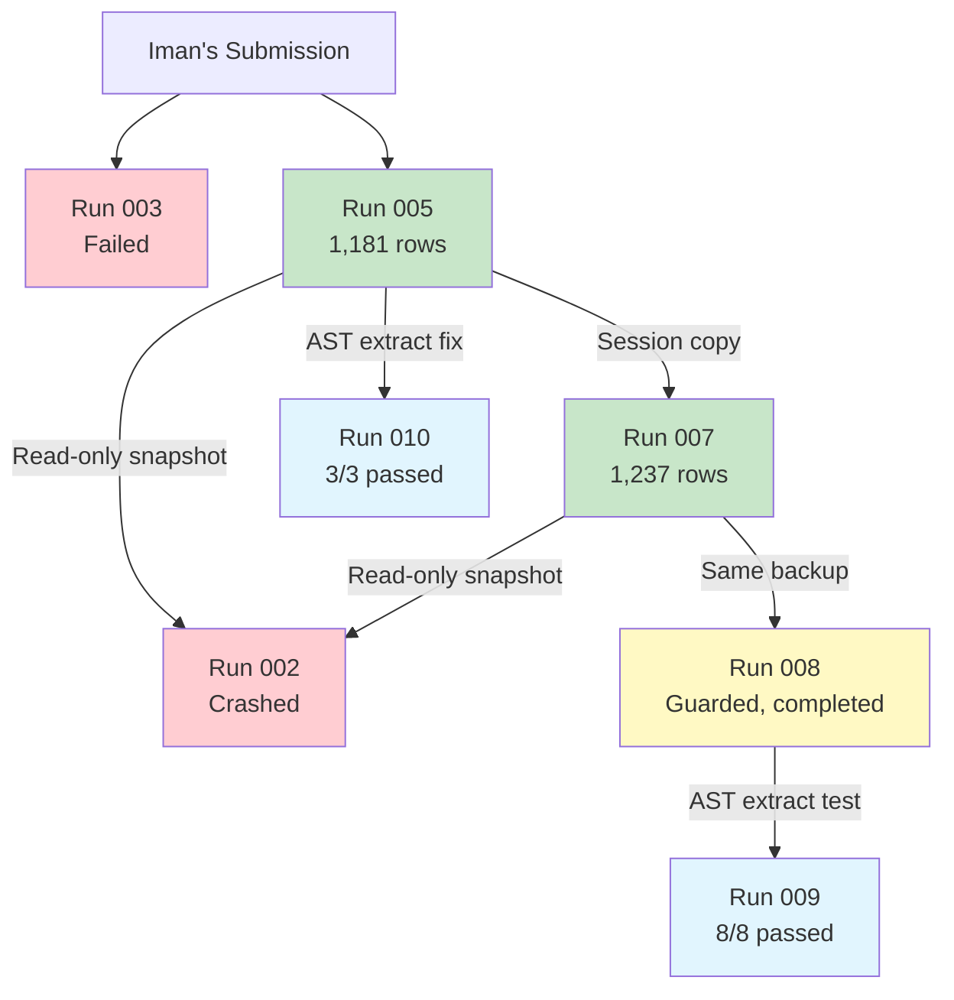

# Saintiment — Iman Live Pilot: Complete Technical Report

**18 September 2026** · Experiment `2026-09-17-iman-live-pilot` · Branch `experiment/2026-09-17-iman-live-pilot`

---

## What This Report Covers

This document tells the full story of running Iman Sheikhansari's collector and analysis pipeline for the first time. It records every step, every problem we hit, how we solved each one, and what still needs work. It's written so that anyone on the team — technical or not — can follow what happened and why.

The report is organized in the order things happened, because that's how the problems appeared and how we figured them out.

---

## Table of Contents

1. [The Big Picture](#1-the-big-picture)
2. [What We Started With](#2-what-we-started-with)
3. [The Journey: Every Run and What Happened](#3-the-journey-every-run-and-what-happened)
4. [The Three Major Problems We Found](#4-the-three-major-problems-we-found)
5. [The One-Line Fix That Mattered](#5-the-one-line-fix-that-mattered)
6. [What We Learned](#6-what-we-learned)
7. [What Still Needs Work](#7-what-still-needs-work)
8. [Run Reference Table](#8-run-reference-table)

---

## 1. The Big Picture



**In plain English:** Iman submitted two Python scripts — a collector (scrapes LinkedIn posts) and an analysis pipeline (runs statistical tests on the collected data). We never edited those originals. Instead we made copies, ran them in isolated folders, recorded every result, and fixed bugs in new copies. By the end we had 1,237 posts collected and a working (but limited) analysis — plus we found and fixed a critical bug in how the collector extracts author headlines.

---

## 2. What We Started With

### 2.1 The Code

Iman's submission contained two files extracted from `.docx` exports of Google Docs:

| File                   | What It Does                                                                                                                         | Original SHA-256 |
| ---------------------- | ------------------------------------------------------------------------------------------------------------------------------------ | ---------------- |
| `collector.py`         | Opens Chrome, logs into LinkedIn, runs 24 search queries, scrolls 35 times each, saves posts to SQLite + CSV                         | `cd31372...`     |
| `analysis_pipeline.py` | Reads the database, classifies stakeholders and sentiment, runs Kruskal-Wallis, Dunn, and Chi-Square tests, exports tables and LaTeX | `9aed216...`     |

### 2.2 The Setup

We made a few preparation changes before running anything:

- **Line endings:** The originals had Windows-style `\r\n` line endings. We converted them to Unix-style `\n`. This changes the file hash but not the code behavior.
- **Snapshot policy:** Every run gets its own private copy in `_local/work/<experiment>/runs/<run-id>/code/`. The originals are never touched.
- **Environment:** We reused the project's existing `.venv` (Python 3.13.11 on macOS ARM64) instead of creating a new one. This was a deliberate shortcut, not best practice.

### 2.3 The Workflow

Each run follows this pattern:



The Node.js wrapper (`run-once.cjs`) starts the Python process, captures environment info and hashes, applies a watchdog timer, and writes a detailed `manifest.json` when the process finishes.

---

## 3. The Journey: Every Run and What Happened

```mermaid
timeline
    title Collection &amp; Analysis Timeline (2026-09-17 UTC)
    20:49 : Run 001 starts
          : Assistant interrupts it
    21:08 : Run 003 starts
          : Fails — old login selector
    21:18 : Run 006 diagnostic
          : Confirms login works, selector changed
    21:26 : Run 005 starts with fix
    22:26 : Watchdog kills Run 005
          : 1,181 rows saved
    22:36 : Run 007 resumes queries 23-24
    22:41 : Run 007 completes
          : 1,237 rows total
    22:44 : Run 002 analysis
          : Crashes — all headlines empty
    22:54 : Run 008 guarded analysis
          : Completes, tests skipped
```

### 3.1 Run 001 — The Interrupted Start

**What we tried:** First live collector run.

**What happened:** The assistant stopped the run without Kaveh asking. This was a mistake — the terminal was killed, leaving the Python process orphaned.

**Result:** Unknown. We don't know if login worked or how many posts were collected. The database was essentially empty.

**Lesson learned:** Never stop a running collector unless the user explicitly asks. The manifest was preserved with its `running` status to record exactly what happened.

### 3.2 Run 003 — The Login Selector Problem

**What we tried:** Second attempt with the original code.

**What happened:** The collector waited 5 minutes for `nav.global-nav` to appear on the LinkedIn feed page. It never did. LinkedIn had changed their HTML — the navigation bar no longer uses CSS class `global-nav`. The collector timed out and exited.

**How we diagnosed it:** We created **Run 006**, a small diagnostic script that opened LinkedIn using the same browser profile and took a screenshot plus a DOM snapshot. The screenshot showed Kaveh was signed in and on the feed. The DOM snapshot showed the navigation uses auto-generated CSS classes — `global-nav` simply doesn't exist anymore.

**Error seen:**

```
Timeout 300000ms exceeded waiting for nav.global-nav
```

### 3.3 Run 005 — The Fixed Readiness Check

**What we changed:** One part of the collector — the login/feed readiness check. Instead of looking for `nav.global-nav`, we wrote a JavaScript function that checks:

- The URL is `www.linkedin.com/feed`
- A visible `main#workspace` element exists
- A visible navigation element exists (in `header nav`)
- No visible password field (meaning we're already logged in)

The **original code:**

```python
page.wait_for_selector("nav.global-nav", timeout=300000)
```

The **fixed code** (only one function changed, everything else identical):

```python
page.wait_for_function("""
    () => {
        const visible = (element) => {
            const rect = element.getBoundingClientRect();
            const style = getComputedStyle(element);
            return rect.width > 0 && rect.height > 0 &&
                style.visibility === 'visible' && style.display !== 'none';
        };
        const anyVisible = (selector) =>
            Array.from(document.querySelectorAll(selector)).some(visible);
        return location.hostname === 'www.linkedin.com' &&
            (location.pathname === '/feed' || location.pathname === '/feed/') &&
            ((anyVisible('main#workspace') && anyVisible('header nav')) ||
                anyVisible('nav.global-nav')) &&
            !anyVisible('input[type="password"]');
    }""",
    timeout=300000
)
```

**What happened:** The readiness check passed. The collector scraped 22 complete queries (35 scrolls each) and was in the middle of query 23 when the wrapper's one-hour watchdog timer fired.

**Result:** **1,181 rows** saved in the database. SQLite integrity check passed. All 1,181 post IDs are unique.

**Watchdog note:** We set a 1-hour limit because we didn't know how long the full 24-query collection would take. It turns out 1 hour only covers about 22.5 queries. This is not a bug — it's a safety limit we intentionally set. The data was saved properly.

### 3.4 Run 007 — The Resume

**What we changed:** Only one line — the query loop. Instead of starting from query 1, we told it to start from query 23:

```python
# Original: for idx, q in enumerate(QUERY_VECTORS, start=1):
# Fixed:
for idx, q in enumerate(QUERY_VECTORS[22:], start=23):
```

**Preparation steps:**

1. Made a complete SQLite backup from the closed 005 database (read-only connection)
2. Verified integrity (`PRAGMA quick_check`) and 1,181 rows
3. Copied the browser session (so we stay logged in)
4. Hit a problem: Chrome had left a dangling `RunningChromeVersion` symlink
5. Fixed by excluding that symlink from the copy (doesn't affect functionality)
6. Increased watchdog to 2 hours for safety
7. Recorded the failed preparation attempt in `preparation.json` before repairing

**What happened:** Both remaining queries (23 and 24) completed all 35 scrolls each. Query 23 was replayed from the top — there's no saved scroll checkpoint in the original code.

**Result:** **1,237 rows** total — **56 more** than run 005. All post IDs unique, integrity check passed.

**Important caveat:** The application log reports "62 new records." This number is wrong. The SQLite `UPSERT` in the code reports `inserted` for both new inserts AND updates to existing rows. The real number is 56. **Always count the database, not the application counter.**

### 3.5 Run 002 — The Original Analysis (Failed)

**What we tried:** Run the original `analysis_pipeline.py` on the collected data.

**What happened:** The pipeline loaded 1,237 records and immediately crashed:

```
ValueError: No data; `observed` has size 0.
```

**Why:** The analysis classifies stakeholders by looking at `author_headline`. But every single one of the 1,237 records had an **empty headline**. When it tried to build a stakeholder × stance contingency table for the chi-square test, the table was completely empty — causing `scipy.stats.chi2_contingency()` to crash.

The enriched CSV and Parquet files were saved before the crash, so we had partial output (1,237 rows, all labeled `Unclassified`).

### 3.6 Run 009 — Guard Tests (Preparation)

**What we did:** Before fixing the analysis code, we wrote 8 synthetic tests to make sure our fixes wouldn't break anything. These tests use fake data to check every edge case:

| Test Case             | What It Checks                             | Result  |
| --------------------- | ------------------------------------------ | ------- |
| All unclassified      | Empty stakeholder data → all tests skipped | ✅ Pass |
| Singleton contingency | 1×1 table → chi-square skipped             | ✅ Pass |
| Identical values      | All same polarity → Kruskal skipped        | ✅ Pass |
| Valid 2×2             | Normal data → computes correctly           | ✅ Pass |
| Valid 3×3             | Multi-category → computes correctly        | ✅ Pass |
| Dunn unavailable      | Missing package → handled gracefully       | ✅ Pass |
| Dunn nonsignificant   | Kruskal not significant → Dunn skipped     | ✅ Pass |
| Missing DB            | No database → explicit error               | ✅ Pass |

All 8 tests passed with exit code 0.

### 3.7 Run 008 — The Guarded Analysis (Completed, Skipped)

**What we changed in the analysis code:**

| Change                                       | Why                                                     |
| -------------------------------------------- | ------------------------------------------------------- |
| Guard around empty contingency tables        | Prevent crash when no stakeholder data exists           |
| Guard around insufficient groups for Kruskal | Need ≥2 groups with ≥3 members each                     |
| Guard around identical values                | Kruskal can't run if all values are the same            |
| Guard around empty database                  | Explicit clear error instead of cryptic crash           |
| Skip-status JSON output                      | Records exactly which tests ran and which were skipped  |
| Tables saved even when tests skip            | Lets us inspect what data exists                        |
| Read-only database connection                | Prevents accidental writes                              |
| Expected count reporting for chi-square      | Transparency without claiming assumptions are validated |

**What happened:** The pipeline completed successfully (exit 0). It produced:

- 5 aspect descriptive statistics (how many posts mention each topic)
- Empty stakeholder contingency table (because no stakeholders were identified)
- LaTeX tables 1 and 3
- A `inferential_test_status.json` file recording all skips

**All three statistical tests were skipped:**

- **Kruskal-Wallis:** Skipped — no stakeholder groups had any members
- **Dunn post-hoc:** Skipped — the Kruskal prerequisite wasn't met
- **Chi-Square:** Skipped — the contingency table was empty

**This is NOT a failure of the analysis code.** The analysis correctly identified that it didn't have the data it needed and refused to produce meaningless results.

---

## 4. The Three Major Problems We Found



### Problem 1: LinkedIn Changed Their HTML

**The symptom:** Collector waited 5 minutes and then crashed.

**The cause:** The original code waits for `nav.global-nav` — a CSS class LinkedIn no longer uses.

**The fix:** Replaced the CSS class selector with a JavaScript function that checks for actual visible navigation elements, the correct URL, and the absence of a password field.

**Status:** ✅ Fixed in Run 005. The fix is narrow — only the readiness check changed.

### Problem 2: All 1,237 Headlines Are Empty

**The symptom:** Analysis crashed because no stakeholders could be classified.

**The cause:** This took some detective work. Here's what's happening in the collector's JavaScript code:

```javascript
// Step 1: Get all the text from the card and collapse whitespace
const fullCard = cleanStr(card.innerText);
// cleanStr does: replace(\u00a0, ' ') → collapse all whitespace → trim
// So "Kaveh Momeni\nArchitect\nPost text" becomes "Kaveh Momeni Architect Post text"

// Step 2: Split on newline to find lines — BUT fullCard has no newlines anymore!
const textLines = fullCard
  .split("\n")
  .map((l) => cleanStr(l))
  .filter(Boolean);
// Result: ["Kaveh Momeni Architect Post text"] — just ONE line

// Step 3: Find the author's name, then take the NEXT line as the headline
// But there IS no next line — there's only one line!
```

**The timeline of what happens to the data:**



**What could have worked:**

```javascript
// Split the ORIGINAL text BEFORE cleaning each line
const textLines = (card.innerText || "")
  .split("\n")
  .map((l) => cleanStr(l))
  .filter(Boolean);
// Result: ["Kaveh Momeni", "Architect", "Post text..."] — THREE lines
// Now line 1 (after the author) IS the headline: "Architect"
```

**Additional extraction problems:** Even if the headline extraction worked, the CSV shows:

- Only **189 of 1,237** rows have a nonempty `author_name` (15%)
- Of those 189, **138 are `Unknown`** (73%)
- **1,099 rows** have a profile URL — this is the most reliable field

**Status:** 🟡 The bug is diagnosed and a fix exists (Run 010). The fix is tested with synthetic data. But the existing 1,237 rows **cannot be repaired** — they'd need to be recollected.

### Problem 3: One Hour Was Too Short

**The symptom:** The collector was killed during query 23.

**The cause:** We didn't know how long 24 queries × 35 scrolls would take. The 1-hour watchdog was a safety limit, not a bug.

**The fix:** For the resume (Run 007), we:

1. Changed the query loop to start from query 23
2. Increased the watchdog to 2 hours
3. Used a separate database copy so the original 005 data was safe

**Status:** ✅ Resolved. The resume completed successfully.

---

## 5. The One-Line Fix That Mattered

The headline extraction bug is fixed by changing **one expression** in the browser JavaScript:

**Before (broken):**

```javascript
const textLines = fullCard
  .split("\n")
  .map((l) => cleanStr(l))
  .filter(Boolean);
```

**After (fixed):**

```javascript
const textLines = (card.innerText || "")
  .split("\n")
  .map((l) => cleanStr(l))
  .filter(Boolean);
```

**The difference:** `fullCard` is already whitespace-collapsed (all newlines turned to spaces). `card.innerText` preserves the original newlines. By splitting the original text, each line stays separate, and the code can find the headline on the line after the author's name.

### Test Results (Run 010)

We wrote three independent tests to confirm the fix:

| Test          | Method                                 | Original Result     | Fixed Result                    |
| ------------- | -------------------------------------- | ------------------- | ------------------------------- |
| Unit test     | Node.js with raw `cleanStr`            | 1 line, no headline | 3 lines, headline = "Architect" |
| Browser test  | Playwright headless with synthetic DOM | Empty headline      | Headline = "Architect"          |
| Database test | Full flow through SQLite + CSV         | N/A                 | Headline = "Architect" in both  |

All three tests passed. The fixed derivative is at `runs/010-collector-headline-fix/code/collector.py`.

**⚠️ Important caveat:** The synthetic DOM test uses `<br>` tags to separate lines. Real LinkedIn uses a mix of HTML elements whose `innerText` behavior may differ. The fix is correct in principle but has not been tested against actual LinkedIn markup.

---

## 6. What We Learned

### 6.1 About the Code



**What works:**

- The collector can scrape LinkedIn successfully
- The readiness check fix resolves the login selector problem
- SQLite storage and CSV export work correctly
- Post deduplication (by URL hash) works
- The analysis pipeline's aspect sentiment scoring runs
- Descriptive statistics are produced correctly

**What doesn't:**

- Headline extraction is broken (fixed but not live-tested)
- Author name extraction is unreliable (only 15% populated)
- The "new records" counter overcounts (SQLite UPSERT reporting bug)
- No scroll checkpointing — an interruption means restarting the current query
- The analysis crashes on empty input (fixed in the guarded version)
- `datetime.utcnow()` is deprecated (warning only, doesn't affect results)

### 6.2 About the Process

1. **Browser selectors are fragile.** LinkedIn changed class names between when Iman wrote the code and when we ran it. A visible-element check is more robust than a CSS class check.

2. **Always validate the data before analysis.** If we'd checked the CSV contents before running analysis, we would have seen the empty headlines immediately.

3. **Separate concerns.** Using different runs for collection, analysis, and testing keeps the provenance clear. The private wrapper and manifest system worked well.

4. **Watchdogs need calibration.** We guessed 1 hour. It turned out to need about 1 hour and 15–20 minutes for all 24 queries. For next time, measure one query's duration first.

5. **Session reuse works but is not clean.** Copying the browser profile let us resume without logging in again. But it means we can't claim a "fresh" session. This is acceptable for engineering pilots, not for reproducible research.

---

## 7. What Still Needs Work

### 🔴 Critical — Must Fix Before Recollection

| Item                   | What's Needed                                                  | Where                            |
| ---------------------- | -------------------------------------------------------------- | -------------------------------- |
| Headline extraction    | Apply the Run 010 fix, test against real LinkedIn markup       | `collector.py` BROWSER_PARSER_JS |
| Author name extraction | Investigate why 85% of names are empty                         | Collector JS/DOM logic           |
| Query version          | Freeze the 24 queries OR implement the team's proposed changes | `QUERY_VECTORS`                  |

### 🟡 Important — Should Fix

| Item                   | What's Needed                                             | Where                              |
| ---------------------- | --------------------------------------------------------- | ---------------------------------- |
| Scroll checkpointing   | Save progress per query so interruption doesn't lose work | `process_query()`                  |
| UPSERT counter fix     | Change reporting to use database counts, not rowcount     | `DatabaseManager.persist_record()` |
| `utcnow()` deprecation | Replace with `datetime.now(timezone.utc)`                 | Collector                          |
| Chi-square guard       | Apply Run 008's guards to the analysis pipeline           | `analysis_pipeline.py`             |

### 🟢 Nice to Have

| Item                         | What's Needed                                   |
| ---------------------------- | ----------------------------------------------- |
| Time-per-query measurement   | Add timing to calibrate future watchdog limits  |
| Semantic deduplication       | Posts with different URLs may have same content |
| Extraction quality metrics   | What percentage of posts have usable text?      |
| Multi-line headline handling | Some headlines span multiple lines              |

### 📋 Research and Process

| Item                        | Status                                  |
| --------------------------- | --------------------------------------- |
| LinkedIn access/permission  | DSA case open; no research approval yet |
| Data retention policy       | Not defined                             |
| Train/validation/test split | Not established                         |
| Query version freeze        | Team feedback pending                   |
| University requirements     | Not confirmed                           |

---

## 8. Run Reference Table

| Run | Type       | Status      | Rows    | Exit    | Key Detail                              |
| --- | ---------- | ----------- | ------- | ------- | --------------------------------------- |
| 001 | Collector  | Interrupted | Unknown | N/A     | Assistant stopped it; incomplete        |
| 003 | Collector  | Failed      | 0       | 1       | Old `nav.global-nav` selector timeout   |
| 004 | Diagnostic | Not run     | —       | —       | Prepared but skipped (006 used instead) |
| 005 | Collector  | Interrupted | 1,181   | SIGTERM | Watchdog at query 23; all data saved    |
| 006 | Diagnostic | Completed   | 0       | 0       | Confirmed login works; no `global-nav`  |
| 007 | Collector  | Completed   | 1,237   | 0       | Resumed queries 23–24; net +56          |
| 002 | Analysis   | Failed      | 1,237   | 1       | Empty contingency crash                 |
| 008 | Analysis   | Completed   | 1,237   | 0       | Guarded; all tests skipped              |
| 009 | Test       | Completed   | 0       | 0       | 8/8 synthetic guard tests passed        |
| 010 | Test       | Completed   | 0       | 0       | 3/3 headline fix tests passed           |

### Data Flow Between Runs



---

## Appendix A: Key Files and Their Locations

### Public (on GitHub)

| File                                                       | Purpose                            |
| ---------------------------------------------------------- | ---------------------------------- |
| `experiments/2026-09-17-iman-live-pilot.md`                | Experiment plan and current status |
| `experiments/runs/.../001-collector.md` through `010-*.md` | Individual run records             |
| `experiments/runs/README.md`                               | Per-invocation workflow guide      |
| `research/project-log.md`                                  | Session-by-session project history |

### Private (local only, not in Git)

| File                                                  | Purpose                                |
| ----------------------------------------------------- | -------------------------------------- |
| `_local/submissions/2026-09-06-iman-protocol-drafts/` | Iman's original, unmodified submission |
| `_local/work/.../runs/*/manifest.json`                | Per-run metadata, hashes, environment  |
| `_local/work/.../runs/*/corpus_data/`                 | All collected data, enriched outputs   |
| `_local/work/.../runs/*/logs/`                        | stdout, stderr for each run            |
| `_local/work/.../runs/*/code/`                        | Frozen code snapshots for each run     |

---

## Appendix B: Technology Stack

| Component       | Version                            |
| --------------- | ---------------------------------- |
| Python          | 3.13.11                            |
| OS              | macOS 26.6.2 (ARM64)               |
| Playwright      | 1.62.0                             |
| NumPy           | 2.5.3                              |
| Pandas          | 3.0.5                              |
| SciPy           | 1.18.1                             |
| PyArrow         | 25.0.1                             |
| Statsmodels     | 0.15.0                             |
| scikit-posthocs | 0.17.0                             |
| scikit-learn    | 1.9.1                              |
| Jinja2          | 3.1.6                              |
| SQLite          | 3.43+ (system)                     |
| Node.js         | v24.18.1                           |
| Git             | Homebrew (not Apple's bundled git) |

---

_This report was generated from verified run manifests, tool outputs, source review, and the project log. All private data, credentials, and raw post content remain local-only and were not included. No scientific findings or platform permissions are claimed._
