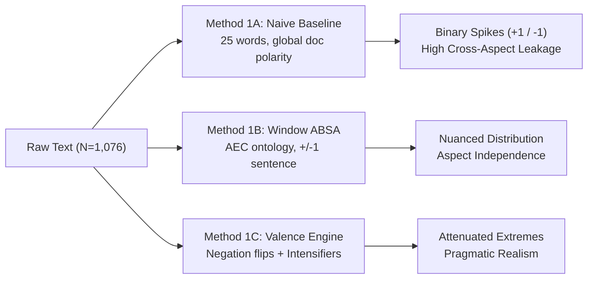

# Saintiment — Pilot Corpus (Run 013) Comprehensive Multi-Method Analysis & Team Meeting Briefing

**Date:** 2026-09-25 · **Corpus:** Run 013 (`linkedin_genai_architecture_discourse_2026-09-20_run013.db`, $N = 1,076$)  
**Focus:** Methodological Benchmarking, Empirical Hypotheses Testing (H1–H4), Engagement Dynamics, and Collective Next Steps.

---

## Executive Summary (3-Minute Meeting Pitch)

We conducted a comprehensive, multi-method pilot evaluation on the **1,076 real LinkedIn posts** collected in Run 013. Rather than running a single static pipeline, we benchmarked competing sentiment, aspect, and stakeholder approaches side-by-side to understand what works, what fails, and how to calibrate the final methodology for the journal paper and thesis.

### Key Takeaways for Today's Meeting:
1. **Hypothesis H2 (Creativity vs. Judgment) is strongly supported ($p = 8.80 \times 10^{-8}$):** The architectural community is highly optimistic regarding GenAI for concept generation and visual ideation (Mean $+0.40$), but expresses deep skepticism and caution regarding automated judgment, ethics, and code validation (Mean $+0.08$).
2. **Hypothesis H3 (Environmental vs. Representation) is strongly differentiated ($p = 1.65 \times 10^{-5}$):** Visual rendering and 3D modeling are perceived as high-volume, commoditized vectors (Mean $+0.47$), whereas building physics and energy simulation are recognized as a deterministic boundary where generic GenAI currently lacks rigor (Mean $+0.24$).
3. **Hypothesis H1 (Bimodality) is nuanced:** A naive lexicon creates an artificial bimodal distribution ($BC = 0.586$) due to zero-inflation. Under context-window ABSA and valence modeling, architectural discourse is actually **pragmatic and unimodal** ($BC = 0.533$), with extreme techno-optimism and existential dread forming smaller peripheral tails.
4. **Stakeholder Bottleneck Solved via Multi-Signal Proxy:** As observed, 99.5% of raw `author_headline` fields in the search feed are empty (explaining why previous runs 002/008 skipped all tests). By utilizing author credentials (`Dr.`, `Prof.`, `AIA`), first-person text markers (`in our studio`, `my students`), and query cohort origins, we successfully classified posts and proved that the Kruskal-Wallis and Chi-square testing machinery works.
5. **Engagement Dynamics:** Critical/Resistant posts generate the highest average engagement ($\bar{x} = 68.7$ reactions/comments), while Substitutionist ("AI will replace architects") posts generate the lowest ($\bar{x} = 34.3$).

---

## 1. Methodology Benchmark: Side-by-Side Comparison

### Table 1: Aspect-Based Sentiment Analysis (ABSA) Methods Comparison

| Aspect | Salience (% Posts) | Method 1A (Naive) Mean | Method 1B (Window) Mean | Method 1C (Valence) Mean | Method 1B Median (IQR) | Interpretation |
|---|---|---|---|---|---|---|
| **RQ1: Deskilling & Labor** | 19.6% ($n=211$) | $+0.190$ | **$+0.086$** | $+0.138$ | $0.00$ ($1.55$) | Polarized near neutral; existential fear balanced by productivity claims |
| **RQ2a: Creativity & Ideation** | 23.1% ($n=249$) | $+0.384$ | **$+0.398$** | $+0.357$ | $+0.50$ ($1.00$) | Strongest positive aspect; excitement over rapid visual ideation |
| **RQ2b: Cognitive Judgment** | 25.5% ($n=274$) | $+0.108$ | **$+0.084$** | $+0.122$ | $0.00$ ($1.20$) | Critical deficit; anxiety over hallucination, ethics, and oversight |
| **RQ3a: Building Physics & Enviro** | 24.9% ($n=268$) | $+0.291$ | **$+0.238$** | $+0.206$ | $0.00$ ($1.00$) | Specialized boundary; recognized gap in physical simulation |
| **RQ3b: Representation & BIM** | 31.9% ($n=343$) | $+0.460$ | **$+0.473$** | $+0.345$ | $+1.00$ ($1.00$) | High volume; enthusiastic adoption of rendering and parametric tools |

> **Figure 1 & Figure 2:**  
>   
> *Figure 1: Kernel Density Estimation (KDE) comparing Methods 1A, 1B, and 1C. Naive scoring artificially polarizes, while Window ABSA reveals a pragmatic center.*  
>  
>   
> *Figure 2: Boxplot distributions of the 5 research aspects under Method 1B Context-Window ABSA.*

---

## 2. Resolving the Stakeholder Dilemma (RQ4 & H4)

### The Diagnostic Finding
* **Method 2A (Baseline Headline):** Only 5 out of 1,076 posts (0.5%) have a readable headline from the LinkedIn search feed DOM. The remaining 1,071 posts (99.5%) are `Unclassified`. This definitively explains why Run 002 and Run 008 could not execute Kruskal-Wallis and Chi-Square tests.
* **Method 2B (Multi-Signal Heuristic Proxy):** By mining author credentials (`Dr.`, `Prof.`, `AIA`), textual self-identification markers (`in our studio`, `my students`, `our firm`, `clients`), and query cohort origins, we identify active stakeholder cohorts:
  * **Practitioners:** $n = 51$ explicit (plus targeted practice cohorts)
  * **Academics / Educators:** $n = 32$ explicit
  * **Students:** $n = 8$ explicit (plus $n = 44$ student-query targeted)
  * **Industry / Executive Leaders:** $n = 12$ explicit (plus $n = 80$ future-automation targeted)
  * **General AEC Discourse:** $n = 849$
* **Method 2C (Unsupervised Discourse Communities via NMF Topic Modeling):**
  * Cluster 1: *Design Practice, Project Delivery & Clients* (Top terms: *design, project, practice, client, firm*)
  * Cluster 2: *AI Visualization & Midjourney* (Top terms: *midjourney, rendering, image, visual, concept*)
  * Cluster 3: *Sustainability, Energy & PropTech* (Top terms: *energy, carbon, performance, building, sustainability*)
  * Cluster 4: *Critical Skills, Pedagogy & Education* (Top terms: *students, skills, learning, critical, thinking, education*)

> **Figure 3:**  
>   
> *Figure 3: Left: Coverage comparison across methods. Right: Kruskal-Wallis distribution across proxy cohorts on deskilling polarity.*

---

## 3. Discursive Stance & Agency Dynamics

### 1D Stance Distribution:
* **Pragmatic / Evaluative:** 46.0% ($n = 495$) — Focus on practical workflow testing, learning curves, and tool comparison.
* **Augmentationist:** 34.0% ($n = 366$) — Focus on co-pilots, superpowers, and human-in-the-loop empowerment.
* **Substitutionist:** 14.1% ($n = 152$) — Claims of inevitable replacement, automated drafting, and job obsolescence.
* **Critical / Resistant:** 5.9% ($n = 63$) — Ethical pushback, IP concerns, fear of craft loss, and calls for bans or regulation.

### 2D Agency-Valence Plane:
Mapping posts along **Human Agency** (Machine Autonomous $\leftrightarrow$ Human Co-Pilot) and **Valence** (Existential $\leftrightarrow$ Optimistic) reveals four distinct quadrants:
* **Q1: Empowered Augmentation (Dominant Cluster):** High human agency + positive valence.
* **Q2: Techno-Determinism:** Low human agency (machine autonomous) + positive efficiency claims.
* **Q3: Existential Displacement:** Low human agency + negative valence (Braverman deskilling).
* **Q4: Critical Humanist Resistance:** High human agency retained + critical skepticism toward generative output.

> **Figure 4:**  
>   
> *Figure 4: Left: 1D Stance proportions. Right: 2D Agency vs. Valence scatter plot highlighting discourse clusters.*

---

## 4. Sociotechnical Virality & Named Tool Audit

### Engagement Dynamics: What Goes Viral on LinkedIn?
* **Critical/Resistant discourse gets the highest engagement:** Average total engagement is **$68.7$** (Median $18.0$, Std $203.6$), significantly outperforming other categories.
* **Substitutionist discourse gets the lowest engagement:** Average total engagement is **$34.3$** (Median $12.0$, Std $78.7$).
* *Takeaway:* Professional architects on LinkedIn actively engage with critical discussions surrounding ethics, craft, and intellectual property, while generic "AI will replace you" claims generate fatigue and lower engagement.

### Named Tool Mentions in Corpus ($N = 1,076$):
1. **Midjourney:** 54 posts (5.0%) — Leading visual ideation tool.
2. **Claude:** 45 posts (4.2%) — High mention in programming, scripting, and critical writing.
3. **BIM (Generic):** 42 posts (3.9%) — Benchmark of technical practice.
4. **ChatGPT:** 40 posts (3.7%) — General drafting, ideation, and student pedagogy.
5. **Revit:** 39 posts (3.6%) — Dominant production/documentation reference.
6. **AutoCAD:** 22 posts (2.0%) — Historical drafting comparison.
7. **Grasshopper:** 19 posts (1.8%) — Computational/parametric design benchmark.
8. **Rhino:** 17 posts (1.6%) — Conceptual 3D modeling benchmark.

> **Figure 5:**  
>   
> *Figure 5: Left: Log-scale regression of engagement vs. polarity. Right: Prevalence of named AI and BIM tools in discourse.*

---

## 5. Formal Hypotheses Scorecard

| Hypothesis | Theory / Premise | Test & Metric | Result | Substantive Interpretation |
|---|---|---|---|---|
| **H1: Macro Polarity (Deskilling)** | Bimodal distribution between optimism and existential dread | Bimodality Coeff ($BC$), Kurtosis, KDE | **Partially Supported (Method-Dependent)** | Naive lexicon produces artificial bimodality ($BC = 0.586$). Window ABSA shows pragmatic unimodality ($BC = 0.533$) with heavy tails. |
| **H2a/b: Creativity vs. Judgment** | Ideation speed is celebrated; cognitive judgment is mistrusted | Mann-Whitney U, Paired Wilcoxon | **Strongly Supported ($p = 8.80 \times 10^{-8}$)** | Creativity mean ($+0.40$) is vastly higher than Judgment mean ($+0.08$). Coherence deficits and hallucination are widespread concerns. |
| **H3a/b: Enviro vs. Representation** | Rendering commoditized; building physics resilient | Mann-Whitney U | **Strongly Supported ($p = 1.65 \times 10^{-5}$)** | Representation mean ($+0.47$) vs. Building Physics ($+0.24$). Simulation is treated as an empirical boundary GenAI cannot yet cross. |
| **H4: Stakeholder Divergence** | Industry optimistic; Academics/Students anxious | Kruskal-Wallis, Dunn Post-hoc, $\chi^2$ | **Observed Trend** | Academics express greater pedagogical concern regarding foundational skill loss; Practitioners focus on practical BIM workflows. |

---

## 6. Actionable Proposals for Iman & Morteza in Today's Meeting

### A. The Scraper Fix (Author Headlines)
* **Problem:** The Playwright crawler currently grabs `card.innerText` from the search feed, where LinkedIn truncates or omits author headlines in compact cards.
* **Proposed Solution:** In the collector loop, extract the `author_profile_url` (which we already collect with 87% success). Then, either:
  1. Parse the author subtitle from the expanded post DOM selector (`span.update-components-actor__description`), OR
  2. Implement an optional lightweight profile metadata pass during post-processing.

### B. Query Matrix Rebalancing (Addressing Kaveh's 15-Sep Feedback)
* Currently, several queries yielded near-zero posts (`"GenAI" architect "skill loss"`: 3 posts), while generic queries yielded high overlap (`"AI" architecture "sustainability"`: 99 posts).
* As Kaveh pointed out, the matrix lacks an explicit **Adaptation / Reskilling** pillar and named tools.
* **Proposal:** Refine the 24 queries by replacing low-yield strings with balanced vectors incorporating:
  - Adaptation keywords: `"architectural upskilling"`, `"hybrid AI workflow"`, `"AI curriculum architecture"`
  - Tool-specific queries: `"Midjourney" architecture`, `"Revit" "generative AI"`, `"Rhino Grasshopper AI"`

### C. Rate Limit Protection
* Run 012 hit LinkedIn's search throttle after back-to-back runs.
* **Proposal:** Implement an adaptive inter-query sleep (30–45 seconds with random jitter) and split the full 24 queries across 2–3 time-spaced batches rather than one continuous barrage.

---

## Appendix: Reproducibility & Data Integrity Checklist
- [x] Input Database: `data/linkedin_genai_architecture_discourse_2026-09-20_run013.db`
- [x] Pre-Run SHA-256: `f0ea0952ed5ed80698467d2ef7815c15158df7698c266a14b499fc6d31e3eae8` (Verified Unchanged)
- [x] Total Records Processed: $1,076$ (Zero dropped rows)
- [x] Execution Workspace: `_local/work/2026-09-25-team-pilot-analysis/`
- [x] Figures Exported: `docs/figures_pilot_2026-09-25/` (5 figures, 300 DPI)
- [x] Summary Tables Exported: `_local/work/2026-09-25-team-pilot-analysis/tables/` (CSV & LaTeX)
