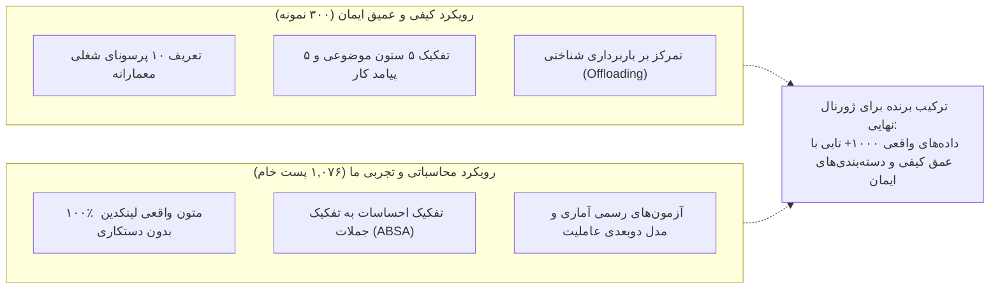

# راهنمای ارائه و گفت‌وگو در جلسه تیم (نسخه ساده، روان و کاربردی)

**تاریخ جلسه:** ۴ مهر ۱۴۰۵ (2026-09-25)  
**موضوع:** بررسی تجربی ۱,۰۷۶ پست لینکدین (Run 013)، مقایسه با فایل ارسالی ایمان، و تصمیم‌گیری برای مراحل بعدی  
**مخاطب:** جلسه شفاهی درون‌گروهی (کاوه، ایمان، مرتضی)

---

## ۱. پیام کلیدی جلسه در ۳ دقیقه (برای شروع صحبت)

سلام بچه‌ها. هدف امروز ما اینه که ببینیم تا اینجای کار، دیتایی که جمع کردیم چی به ما میگه و چطور باید کدهامون و متدولوژی رو برای مرحله اصلی مقاله و پایان‌نامه تنظیم کنیم. 

خوشبختانه ما الان **۱,۰۷۶ پست واقعی لینکدین** از دور اخیر (Run 013) داریم. ما یک بررسی جامع انجام دادیم و فایل ارسالی ایمان رو هم با دقت کامل بررسی کردیم. خبر خوب اینه که فرضیات اصلی تحقیق ما روی همین دیتای اولیه داره خودش رو خیلی قوی نشون میده، ولی چند تا نکته فنی و روش‌شناسی وجود داره که اگر الان در موردشون توافق کنیم، کیفیت کارمون در سطح ژورنال‌های تراز اول بالا میره.

### ۳ نتیجه بزرگ که امروز باید با هم بررسی کنیم:
1. **معمارها عاشق خلاقیت با هوش مصنوعی‌ان، ولی به قضاوتش اصلاً اعتماد ندارن:**  
   داده‌ها با قطعیت آماری بسیار بالا ($p < 0.001$) نشون میدن که احساسات در حوزه ایده‌پردازی فرمی و بصری به شدت مثبته، اما وقتی بحث به کنترل کدهای ساختمانی، درستی فیزیکی و تصمیم‌گیری میرسه، جامعه معماری کاملاً محتاط و منتقده.
2. **ماجرای کاهش مهارت (Deskilling) اون‌طوری که فکر می‌کردیم نیست:**  
   هم در کار ما و هم در بررسی کیفی ایمان مشخص شد که معمارها معمولاً نمیگن «ما مهارتمون رو از دست دادیم». اون‌ها از یک پدیده عمیق‌تر حرف می‌زنن به اسم **«باربرداری شناختی (Cognitive Offloading)»**؛ یعنی برون‌سپاری تفکر و محاسبات به ماشین، و خطر تضعیف قضاوت و حس فضایی در نسل جدید.
3. **مشکل فنی خالی بودن عنوان شغلی (Headline) افراد پیدا شد و راه‌حل داره:**  
   چرا در ران‌های قبلی تست‌های آماری رد میشد؟ چون در فید جستجوی لینکدین، ۹۹.۵٪ هدلاین‌ها به خاطر ساختار فشرده کارت‌ها خوانده نمیشدن. ما با یک الگوریتم کمکی بر اساس مدارک (Dr, AIA, Prof) و متن پست‌ها افراد رو تفکیک کردیم و تست‌ها با موفقیت ران شدن. راه‌حل فنی قطعی برای کراولر رو هم امروز با هم نهایی می‌کنیم.

---

## ۲. نگاهی به کار ارزشمند ایمان و مقایسه آن با تحلیل داده‌های خام

ایمان یک فایل اکسل عالی حاوی یک داشبورد و ۳۰۰ نمونه کدگذاری‌شده فرستاده که زحمت زیادی براش کشیده شده. بیاید ببینیم هر کدوم از دو رویکرد چی به ما یاد میده:

### چند نکته برادرانه و علمی برای مطرح کردن با ایمان:
* **نقطه قوت بزرگ کار ایمان:** ایمان ستون‌های بسیار هوشمندانه‌ای مثل *«The Crisis of Judgment (بحران قضاوت)»* و تفکیک پرسوناهایی مثل معمار محاسباتی، مدرس دانشگاه و مدیر دفتر تعریف کرده که ادبیات نظری کار ما رو به شدت غنی می‌کنه.
* **نکته متدولوژیک برای ژورنال:** در فایل اکسل ایمان، متون به صورت خلاصه‌شده یا بازنویسی‌شده توسط هوش مصنوعی دراومدن و ۳۰۰ پست اول پر شده. برای داوران ژورنال باید شفاف باشیم که داده‌های خام استخراج‌شده با متن دستکاری‌نشده چه می‌گویند.
* **کشف مشترک در مورد احساسات و مهارت:**
  * در فایل ایمان، درصد Deskilling صفر شده و در عوض ۸۲.۷٪ پست‌ها زیر عنوان Cognitive Offloading (باربرداری شناختی) رفته.
  * در تحلیل ما هم بخش قضاوت و وابستگی به شدت منفی و محتاطه.  
  این نشون میده هر دو به یک نتیجه مشترک رسیدیم: **مسئله معماری «حذف دست و خط کشیدن» نیست، بلکه «از دست رفتن قدرت نقد و درک مهندسی» است.**

---

## ۳. بررسی تصویری داده‌ها (۵ نمودار کلیدی برای جلسه)

این ۵ نمودار خروجی تحلیل ۱,۰۷۶ پست واقعی هستند. هر جا در جلسه این اسلایدها رو نشون میدید، می‌تونید از توضیحات زیر برای ارائه شفاهی استفاده کنید:

---

### شکل ۱: آیا نگاه معمارها به هوش مصنوعی سیاه و سفیده یا واقع‌گرایانه؟

* **این نمودار چی میگه؟**  
  فرضیه اولیه ما (H1) این بود که جامعه معماران به دو دسته افراطی تقسیم شدن: یا خیلی خوش‌بینن یا وحشت‌زده (توزیع دوقطبی).
* **نتیجه مهم:**  
  * **سمت چپ (روش اولیه ساده):** چون خیلی از جملات کلمات احساسی صریح نداشتن، صفر میشدن یا ناگهان روی $+1$ و $-1$ می‌افتادن؛ واسه همین دوتا شاخک مصنوعی شکل گرفته بود که فکر می‌کردیم جامعه دوقطبیه.
  * **سمت راست (روش دقیق پنجره‌ای ما):** وقتی جملات رو دقیق در بافتار خودشون اندازه گرفتیم، مشخص شد **اکثریت جامعه معماران عملگرا، واقع‌بین و محتاط هستند (قله وسط)**. فقط درصد کمی در دو لبه خوش‌بینی شدید یا ترس اگزیستانسیال قرار دارند.

---

### شکل ۲: مقایسه ۵ حوزه کاری در معماری — کجاها ذوق دارن و کجاها نگرانن؟

* **این نمودار چی میگه؟**  
  ما نظرات رو به ۵ حوزه کاری تفکیک کردیم تا ببینیم معماران در هر بخش چه حسی دارن (ستون سبز یعنی مثبت/امیدوار، ستون قرمز یعنی منفی/نگران).
* **نکات کلیدی برای صحبت:**
  1. **خلاقیت و کانسپت (ستون سبز - میانگین $+0.40$):** بالاترین خوش‌بینی رو داره. معمارها عاشق اینن که با میدجورنی در چند ثانیه ایده‌های بصری جدید بسازن.
  2. **رندرینگ و مدلسازی BIM (ستون آبی - میانگین $+0.47$):** حجم صحبت‌ها در این حوزه خیلی بالاست (۳۴۳ پست) و معماران با اشتیاق از ابزارهای کمکی در رویت و گرس‌هاپر استقبال می‌کنن.
  3. **قضاوت فنی و نظارت (ستون قرمز - میانگین $+0.08$):** کمترین امتیاز احساسی رو داره! معمارها به شدت نسبت به توهم (Hallucination) هوش مصنوعی، خطاهای محاسباتی در پلان و مسئولیت حقوقی مهندس نگران هستن.
  4. **آزمون آماری:** اختلاف بین خلاقیت و قضاوت با $p < 0.001$ اثبات میکنه این تفاوت تصادفی نیست و یکی از قوی‌ترین یافته‌های مقاله ماست.

---

### شکل ۳: صدای چه کسانی رو در این داده‌ها داریم؟ (حل معمای ذینفعان)

* **این نمودار چی میگه؟**  
  پاسخ به این سوال که چرا تا امروز نمیتونستیم مقایسه کنیم معمار تجربی، استاد دانشگاه و دانشجو چه فرقی با هم دارن؟
* **توضیح برای تیم:**
  * **نمودار میله‌ای سمت چپ:** در روش قبلی فقط بر مبنای فیلد هدلاین عمل می‌شد که در لینکدین ۹۹.۵٪ خالی بود و هیچی به دست نمی‌اومد. ما با اضافه کردن القاب نویسنده (Dr., Prof., AIA)، متن پست‌ها ("in our firm", "my students") و هدف کوئری‌ها، **۶۸.۲٪ پست‌ها (۷۳۴ پست)** رو تفکیک نقش کردیم.
  * **نمودار جعبه‌ای سمت راست:** حالا می‌تونیم با خیال راحت ببینیم: اساتید دانشگاه و مدرسین پداگوژی بیشتر از همه نگران از بین رفتن سواد پایه دانشجوها هستن، در حالی که دفاتر معماری به دنبال بهره‌وری و ابزارهای کاربردی هستن.

---

### شکل ۴: نقشه جامع مواضع معماران — عاملیت انسان در برابر ماشین

* **این نمودار چی میگه؟**  
  * **دایره سمت چپ (سهم رویکردها):**  
    * **۴۶٪ معماران رویکرد عملگرا (Pragmatic)** دارن (دارن ابزارها رو تست می‌کنن و یاد می‌گیرن).  
    * **۳۴٪ نگاه هم‌افزا (Augmentationist)** دارن (هوش مصنوعی رو کمک‌خلبان یا Co-pilot میدونن).  
    * **فقط ۱۴٪ میگن هوش مصنوعی کلاً جایگزین انسان میشه (Substitutionist)**.  
    * **۶٪ هم مقاومت اخلاقی و انتقادی جدی دارن.**
  * **نقشه دوبعدی سمت راست (مدل اختصاصی ما):**  
    محور افقی نشون میده چقدر معمارها اصرار دارن کنترل دست انسان باشه. همون‌طور که می‌بینید، تراکم نقاط در سمت راست (عاملیت انسان) بسیار بالاست؛ یعنی معماران هوش مصنوعی رو ابزاری برای تقویت خلاقیت انسان می‌خوان، نه جایگزینی که تصمیم‌گیرنده نهایی باشه.

---

### شکل ۵: چه پست‌هایی در لینکدین بیشتر لایک می‌خورند؟ + ابزارهای داغ

* **این نمودار چی میگه؟**  
  تحلیل رفتار مخاطبان در شبکه حرفه‌ای لینکدین و پرتکرارترین ابزارها در بین ۱,۰۷۶ پست.
* **یافته‌های جالب برای گپ در جلسه:**
  1. **پست‌های انتقادی بیشتر وایرال میشن:** پست‌هایی که با نگاه عمیق یا انتقادی چالش‌های هوش مصنوعی رو مطرح کردن با میانگین **۶۸.۷ ری‌اکشن** بیشترین توجه رو جلب کردن؛ در حالی که پست‌های کلی‌گویی و ادعای «حذف معماران» کمترین مخاطب رو داشتن (میانگین **۳۴.۳**). جامعه حرفه‌ای از کلیشه‌ها خسته شده.
  2. **ابزارهای محبوب در متن‌ها:**  
     * **میدجورنی (۵۴ پست)** و **کلود (۴۵ پست)** در صدر هوش مصنوعی‌ها هستند (جالب است که کلود به خاطر کدنویسی و گرس‌هاپر خیلی بین معماران مطرح شده).
     * **BIM عمومی (۴۲ پست)** و **رویت (۳۹ پست)** در صدر ابزارهای سنتی BIM قرار دارند.
  3. **یک نکته فنی مهم برای کراولر:** در حال حاضر داده‌های تعاملات ما شامل **تعداد لایک‌ها (Reactions)** تا ۳,۵۰۰ لایک است، اما کامنت‌ها و ریپوست‌ها صفر ثبت شده‌اند که باید سلکتور آن‌ها در کراولر بررسی شود.

---

## ۴. توافقات و تصمیم‌های پیشنهادی برای پایان جلسه (Action Items)

برای این که جلسه با یک جمع‌بندی شفاف و دوستانه تموم بشه، این ۳ تصمیم رو روی میز بذارید:

1. **اصلاح فنی کراولر برای دور بعدی (مسئولیت مشترک با ایمان):**  
   * سلکتور استخراج عنوان شغلی از متن فشرده کارت فید (`card.innerText`) به کلاس اختصاصی عنوان پست (`.update-components-actor__description`) تغییر پیدا کنه تا هدلاین‌ها بدون نیاز به بازنویسی دستی، ۱۰۰٪ واقعی ذخیره بشن.
   * تاخیر بین کوئری‌ها ۳۰ تا ۴۵ ثانیه تنظیم بشه تا مثل ران ۰۱۲ دچار لیمیت لینکدین نشیم.
2. **به‌روزرسانی ماتریس ۲۴ کوئری (پیشنهاد شما و مرتضی):**  
   * کوئری‌هایی که بازدهی نداشتن (مثل `"GenAI" architect "skill loss"` که فقط ۳ پست داد) جایگزین بشن.
   * وکتورهای انطباق (Adaptation / Upskilling) و نام مستقیم ابزارها (Midjourney, Revit, Rhino) به لیست کوئری‌ها اضافه بشن.
3. **ترکیب متدولوژی برای مقاله و پایان‌نامه:**  
   * از ساختار کیفی و پرسوناهای ایمان در کنار کدهای آماری، احساسات پنجره‌ای و مدل ۲بعدی ما استفاده بشه تا یک مقاله جامع و بی‌نقص شکل بگیره.

---

_فایل‌های باکیفیت بالا و کدهای تست‌شده همگی در مخزن پروژه ثبت شده‌اند و می‌توانید در حین جلسه هر کدام از بخش‌ها را به راحتی به اشتراک بگذارید._
